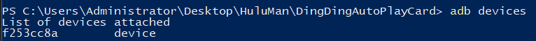
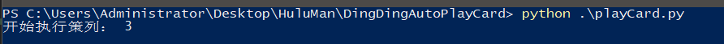

# DingDingAutoPlayCard

---

钉钉自动上下班打卡辅助

超简单！无需了解python也能使用！

别看工程文件多，你仅需小改一下***[settings.py](https://github.com/MrHulu/DingDingAutoPlayCard/blob/master/setting.py)***和***[playCard.py](https://github.com/MrHulu/DingDingAutoPlayCard/blob/master/playCard.py)***这两个文件的参数即可！！！

# 前提条件

* 公司电脑有Python环境
* 一台可以放在公司的安卓手机（如果你没有，抱歉，你可以不用再往下看了）
* 公司电脑需要安装ADB（本项目的根目录提供了windows下adb安装包）

# 电脑准备

1. 安装Python
2. 查看一下电脑的环境变量是否有python路径，没有的话需要添加到系统环境变量Path中
3. 安装后，还需要安装依赖的python库（开了梯子的可能安装失败。最好关了梯子）:

   ```
   pip install flask
   pip install apscheduler
   pip install flask_script
   ```
4. 安装ADB

   1. windows版本adb下载地址:[https://adb.clockworkmod.com/](https://adb.clockworkmod.com/)
   2. 安装完成后，把adb.exe所在文件夹路径加入系统环境变量Path中

# 手机准备

1. 手机需要打开"***开发者选项***"（通常开启方式：在"`关于手机"`连续点击7次 `"版本号"`）
2. 进入"***开发者选项***"，开启"***USB调试模式"***（小米/红米手机需要装上手机卡才能开启，可以装上开启后再拆下来）
3. 手机通过USB数据线连接电脑(可通过wifi来连接手机用adb)。
4. 验证一下，在window中打开cmd命令行，输入“***adb devices***”,能成功显示手机信息即可。

   * 成功如下：

     
5. 获取手机屏幕尺寸，设置模拟点击位置：

   * 可以打开"开发者设置"的输入找到"指针位置" 即可得到点击XY坐标。
   * 

# 配置信息

相关配置都在[***settings.py***](https://github.com/MrHulu/DingDingAutoPlayCard/blob/master/setting.py)文件里定义：

```python
# adb install path
directory = "E:\ADB"
#  go work time  if you are 9  here need  add 8
go_hour = 9
# back work time if you are 18 here need add 18
back_hour = 21


# send personr
sender = "xxxx@qq.com"
# password  Generally, third party login is required authorization code
psw = "xxxx"
# recevie  here It could be yourself
receive = "xxxx@qq.com"

# Screen shot image path (do not include Spaces in the path, in order to save the screen shot sent by the phone, and save it in the email)
screen_dir = "E:\ok"

# Touch the screen on a series of coordinates.
# Slide to unlock
light_position = "500 2000 500 1300"
# Click "work"
work_position = "540 2100"
# Click "Card"
card_position = "150 1000"
# Click "time check"
check_position = "663 1377"
# Click on "off duty"
play_position = "550 1300"

```

根据自己的手机和实际情况填上你自己的信息，以上是示例

# 开始使用

***注意：使用之前，一定要提前准备好各种条件——手机，电脑，配置信息！***

***注意：使用之前，一定要提前准备好各种条件——手机，电脑，配置信息！***

***注意：使用之前，一定要提前准备好各种条件——手机，电脑，配置信息！***

---

在window系统打开cmd命令行，执行以下python脚本即可：



PS: 我在[***playC**ard.py*](https://github.com/MrHulu/DingDingAutoPlayCard/blob/master/playCard.py)中添加了两个封装函数，大家根据自己实际情况选择性调用：

* `auto_playCard(num)` 这个函数是自动打卡功能，运行该脚本之后，实现自动打卡。里面有一些我写好的打卡时间策略，num就是选择使用哪个方案，你可以往里面添加，我的建议是一周换一个策略来打开，因为我的策略都是带有加班的。
* `manually_playCard()` 这个函数是手动打卡功能，运行该脚本，只会打卡一次(***上班下班通用***)
